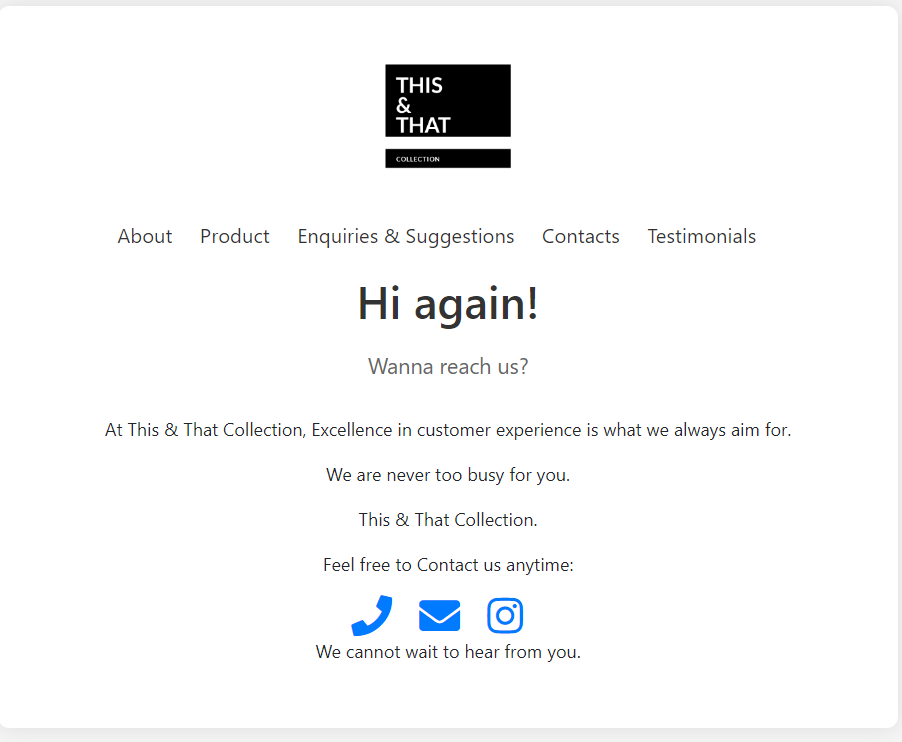

# Web-programming-2-assignment
# This & That Collection

## Application Domain
This & That Collection is a web application designed to showcase a curated selection of fine jewelry and accessories. The application aims to provide users with a seamless shopping experience, allowing them to explore various products, submit testimonials, and make inquiries.

## Features
- **Home Page**: A welcoming introduction with links to navigate to other sections of the website.
- **Products Page**: Displays a selection of jewelry and accessories with images and descriptions.
- **Enquiries & Suggestions Page**: Users can submit inquiries or suggestions for improved customer service.
- **Testimonials Page**: Showcases customer feedback and allows users to submit their own testimonials.
- **Contact Page**: Provides contact information and further details about the business.

## Technologies Used
- HTML
- CSS
- JAVA SCRIPT

## How to Use
1. Navigate through the website using the menu bar to access different sections.
2. On the **Products Page**, browse through the displayed items.
3. On the **Testimonials Page**, read feedback from other customers and submit your own testimonial.
4. Use the **Enquiries & Suggestions Page** to send messages to the business.

## Screenshots of the Pages

1. **Home Page**
   

2. **Products Page**
   

3. **Enquiries & Suggestions Page**
   

4. **Contacts Page**
   

5. **Testimonials Page**
   

## Author
Henry Kioko  
CIT-223-048/2022
